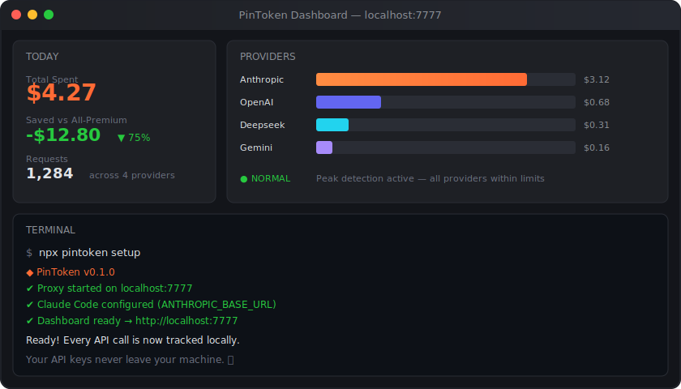

<div align="center">


# PinToken

**Pin your token. Save your dollar.**

Track every LLM API call, visualize costs, and see exactly where your money goes — all locally, all private.

[](LICENSE)
[](https://www.npmjs.com/package/pintoken-cli)
[](https://nodejs.org)
[](#supported-providers)
[](https://github.com/AgenfyLabs/PinToken/pulls)

[Website](https://pintoken.ai) · [Report Bug](https://github.com/AgenfyLabs/PinToken/issues) · [Request Feature](https://github.com/AgenfyLabs/PinToken/issues)

</div>

<br/>

<div align="center">

</div>

<br/>

## Why PinToken?

You're using Claude Code, Cursor, or direct API calls — but do you know **exactly** how much each conversation costs? Which provider is eating your budget? Whether you're hitting rate limits during peak hours?

PinToken is a zero-config local proxy that sits between your tools and LLM providers. It records every token, every dollar, every request — and shows you a real-time dashboard. No cloud required. Your API keys never leave your machine.

## Quick Start

```bash
npx pintoken-cli setup
```

That's it. PinToken will:

1. Start a local proxy on `localhost:7777`
2. Auto-configure Claude Code and your shell
3. Open the dashboard in your browser

Then just point your tools to the proxy:

```bash
# Claude Code (auto-configured)
ANTHROPIC_BASE_URL=http://localhost:7777/anthropic

# Any OpenAI-compatible provider
OPENAI_BASE_URL=http://localhost:7777/openai
```

## Features

<table>
<tr>
<td width="50%">

### 📊 Real-time Cost Tracking
Every API call logged with token counts, costs, and model info. See your spending as it happens — not days later on a billing page.

</td>
<td width="50%">

### 💰 Savings Visualization
Compare actual spend vs. "what if you only used the most expensive model." See the real impact of using smart model routing.

</td>
</tr>
<tr>
<td width="50%">

### ⏰ Peak Hour Alerts
Automatic detection of rate-limit windows. Get notified before you hit provider limits so you can shift workloads.

</td>
<td width="50%">

### 🃏 Shareable Report Cards
Generate a visual savings card and share it on X/Twitter with one click. Show others how much you're saving.

</td>
</tr>
<tr>
<td width="50%">

### 📈 Analytics Dashboard
Tabs for Overview, Analytics, and per-Provider breakdown. Pure SVG charts — no heavy chart libraries.

</td>
<td width="50%">

### ☁️ Cloud Sharing (Optional)
Share your savings card via a public URL. Only anonymized stats are synced — never your API keys.

</td>
</tr>
</table>

## Supported Providers

| Provider | Models | API Format |
|:---------|:-------|:-----------|
| **Anthropic** | Claude Sonnet, Opus, Haiku | Native Anthropic |
| **OpenAI** | GPT-4o, GPT-4o-mini, o3 | OpenAI |
| **xAI** | Grok-3, Grok-3-mini | OpenAI-compatible |
| **Google Gemini** | Gemini 2.0 Flash, Pro | OpenAI-compatible |
| **Deepseek** | deepseek-chat, deepseek-reasoner | OpenAI-compatible |
| **Moonshot (Kimi)** | kimi-k2, moonshot-v1 | OpenAI-compatible |
| **Qwen** | qwen-max, qwen-plus | OpenAI-compatible |
| **GLM** | GLM-4, GLM-4-flash | OpenAI-compatible |

> Most providers use OpenAI-compatible format — PinToken handles routing automatically.

## Architecture

```
Your Tools (Claude Code, Cursor, scripts...)
        │
        ▼
   localhost:7777        ← PinToken Proxy (Node.js)
        │
   ┌────┴─────┐
   │  SQLite   │         ← Token counts, costs, timestamps
   │  ~/.pintoken/       ← All data stays on YOUR machine
   └────┬─────┘
        │
        ▼
   LLM Provider APIs     ← Requests forwarded unchanged
   (Anthropic, OpenAI, ...)
```

## Security

PinToken is built with a **zero-trust** approach to your API keys:

| Principle | How |
|:----------|:----|
| **Keys stay local** | The proxy only forwards requests — keys are never stored, logged, or transmitted to any third party |
| **Cloud is opt-in** | Cloud sharing only syncs anonymized stats: token counts, costs, timestamps, model names |
| **Fully open source** | Audit every line of code yourself on [GitHub](https://github.com/AgenfyLabs/PinToken) |
| **Local storage** | All data in `~/.pintoken/data.db` (SQLite) — your disk, your data |

## CLI Commands

```bash
npx pintoken-cli setup     # First-time setup: proxy + dashboard + auto-config
npx pintoken start     # Start the proxy server
npx pintoken status    # Terminal status panel with live stats
```

## Roadmap

- [x] **M1** — Local proxy + SQLite + Dashboard + CLI setup
- [x] **M2** — 8 providers + Analytics tabs + Peak alerts + Share cards + Cloud API
- [ ] **M3** — Electron desktop app + Cloud sync + Smart routing + Landing page

## Contributing

Contributions are welcome! Feel free to open issues or submit PRs.

```bash
git clone https://github.com/AgenfyLabs/PinToken.git
cd PinToken
npm install
npm start
```

## License

[MIT](LICENSE) — use it however you want.

---

<div align="center">

**If PinToken saved you money, give it a ⭐**

Share your savings card with [#PinToken](https://twitter.com/search?q=%23PinToken) on X

<sub>Built with 🧡 by <a href="https://github.com/AgenfyLabs">AgenfyLabs</a></sub>

</div>
